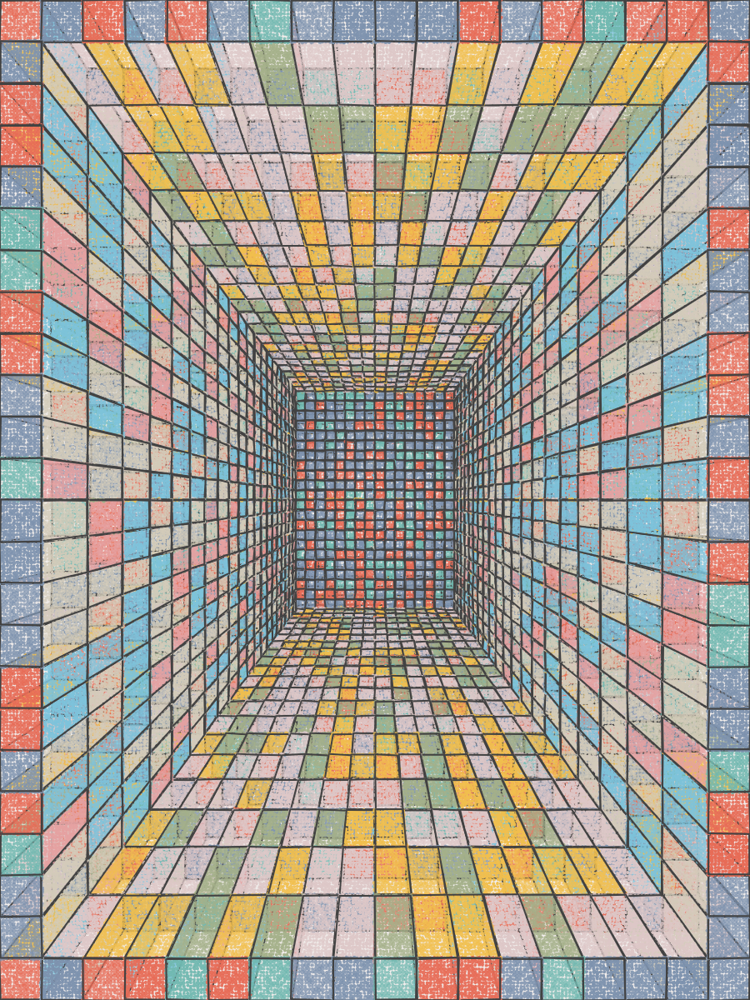

# syntaks

* [About](#about)
* [Art](#art)
* [Writing](#writing)

## About

I make art using code[^1]. Most works are created using JavaScript and [p5.js](https://p5js.org). Also, see my [introductory Twitter thread](https://twitter.com/syntaks_art/status/1627021587277832192).

To get in touch, DM [me on Twitter](http://twitter.com/syntaks_art).

[^1]: Read about [generative art on Wikipedia](https://en.wikipedia.org/wiki/Generative_art)

## Art

### Sketches

<a title="Unremarkable boxes. Are they meaningful to you, anon?" href="sketch1.png"></a>
<a title="Unremarkable boxes" href="sketch2.png"></a>
<a title="Unremarkable boxes" href="sketch3.png"></a>
<a title="Unremarkable boxes" href="sketch4.png"></a>
<a title="Unremarkable boxes. Are they meaningful to you, anon?" href="sketch5.png"></a>
<a title="Unremarkable boxes. Are they meaningful to you, anon?" href="sketch6.png"></a>
<a title="Unremarkable boxes" href="sketch7.png"></a>
<a title="Unremarkable boxes" href="sketch8.png"></a>
<a title="Unremarkable boxes" href="sketch9.png"></a>

## Writing

### Twitter threads

* [Self introduction](https://twitter.com/syntaks_art/status/1627021587277832192)
* [Summary of Ben Kovach's essay "WHAT MAKES GENERATIVE ART HARD?"](https://twitter.com/syntaks_art/status/1627831260578971649)
* [p5.js guide for drawing imperfect circles](https://twitter.com/syntaks_art/status/1633627701910073344) (full version [below](#imperfect-circles))

### p5.js guides

#### Imperfect circles

*(Corresponding Twitter thread linked [above](#twitter-threads))*

Unlike using pen and paper, it’s trivial to draw a perfect circle using common code libraries. In p5.js, you’d do:

```javascript
circle(x, y, diameter);
```

On the other hand, it’s difficult to draw an imperfect circle. Here, we’ll show how it can be done.

First, let’s see how we can draw points on a circle’s circumference:

```javascript
function drawPoints() {
  for (let i = 0; i < numVertices; i++) {
    const rad = i * 2 * PI / numVertices;
    const x = radius * cos(rad);
    const y = radius * sin(rad);
    circle(canvasSide / 2 + x, canvasSide / 2 - y, canvasSide * .05);
  }
}
```

This renders:

<a title="Points on a circle's circumference" href="ic1.png"></a>

The basic idea is to divide one revolution (2π radians) into a fixed number of steps and draw one point per step. Here, each step is `2 * PI / numVertices` radians. We can use trigonometry (see ["Sine and cosine" on Wikipedia](https://en.wikipedia.org/wiki/Sine_and_cosine)) to determine the corresponding points on the circumference.

We don’t actually want to render these points, but we can use them as vertices in a shape. `curveVertex` helps us draw smooth curves between points:

```javascript
function drawShape() {
  beginShape();
  for (let i = 0; i < numVertices; i++) {
    const rad = i * 2 * PI / numVertices;
    const x = radius * cos(rad);
    const y = radius * sin(rad);
    curveVertex(canvasSide / 2 + x, canvasSide / 2 - y);
  }
  endShape();
}
```

<a title="Open shape" href="ic2.png"></a>

That's not quite what we wanted though. From `drawPoints` above, we know the points are placed properly. But we also know they don’t form a closed loop as we didn’t include the first point twice. Further, per `curveVertex`’s [documentation](https://p5js.org/reference/#/p5/curveVertex):

> The first and last points [...] guide the beginning and end of the curve.

This means our first and last points also need points to guide them. That is, we can draw the (closed) circle by duplicating a total three of the existing points. Lastly, we create the imperfection by randomly offsetting each point:

```javascript
function drawImperfectCircle(noise = .1) {
  let vertices = [];
  for (let i = 0; i < numVertices; i++) {
    const rad = i * 2 * PI / numVertices;
    const x = radius * cos(rad) * random(1 - noise, 1 + noise);
    const y = radius * sin(rad) * random(1 - noise, 1 + noise);

    vertices.push({ x: canvasSide / 2 + x, y: canvasSide / 2 - y });
  }

  // Duplicate 3 vertices to close the loop and provide guides for the first and last points.
  for (let i = 0; i < 3; i++) {
    vertices.push(vertices[i]);
  }

  beginShape();
  for (let i = 0; i < vertices.length; i++) {
    curveVertex(vertices[i].x, vertices[i].y);
  }
  endShape();
}
```

<a title="Imperfect circle" href="ic3.png"></a>

And that’s it! Below follow a few simple sketches created using this algorithm.

<a title="Sketch using imperfect circle" href="ic4.png"></a>
<a title="Sketch using imperfect circle" href="ic5.png"></a>
<a title="Sketch using imperfect circle" href="ic6.png"></a>
